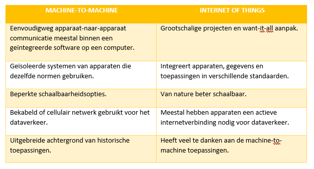

# Machine-to-machine ( M2M ) 
## Wat is machine-to-machine ?
Machine-to-machine, is een brede beschrijving die kan worden gebruikt om eender welke technologie te beschrijven die het mogelijk maakt om apparaten op een netwerk te laten communiceren en informatie uit te wisselen met elkaar. Het speciale aan machine-to-machine is dat al deze uitwisselingen volledig los staan van de mens, zij bieden hierbij geen hulp. Natuurlijk zijn er dus wel andere technologieën nodig die de communicatie tussen systemen vergemakkelijken. Zo heb je artificial intelligence en machine learning die helpen om systemen hun eigen autonome keuzes te laten maken. 

In het begin werd machine-to-machine voor de eerste keer toegepast in de industriële- en productieomgevingen. In deze sectoren werden andere technologieën, zoals SCADA (1) en ‘ remote monitoring ’ gebruikt voor het beheer op afstand en de controle van systeem gegevens.  Later werd machine-to-machine populair in vele andere sectoren, zoals gezondheidszorg, het bedrijfsleven etc. M2M is hierbij ook de **basis van Internet Of Things**. 

(1) SCADA, beter gekend als Supervisory Control And Data Acquisition, houdt het verzamelen, doorsturen, verwerken en visualiseren van meet- en regelsignalen van verschillende grote industriële systemen in. De bediening van het systeem gaat via een computer met de SCADA -software.
De basisfuncties zijn: 
- versturen van instructies naar fysieke controlesystemen
- informatie bieden over metingen afkomstig van sensoren
- alarmeren wanneer iets misgaat in een systeemproces
Het grote doel van machine-to-machine systemen is om de voorgaande versie van het systeem veel efficiënter te maken en in veel gevallen om geld uit te sparen die anders verloren ging. Denk maar aan een apparaat waar veel metingen moeten op gebeuren. Wanneer er geen sensoren en M2M is dan zal hiervoor speciaal een persoon moeten voor aangesteld en dat kost natuurlijk ook geld. 

## Grondlegging
Vanaf het begin van de 20e eeuw gebruiken bedrade machines al signalen om informatie uit te wisselen met elkaar. Machine-to-machine heeft sinds de automatisering van computernetwerken meer verfijnde vormen aangenomen en dateert van voor de cellulaire- of mobiele communicatie. Zoals eerder vermeld werd het gebruikt in toepassingen zoals telemetrie, SCADA, industrie en automatisering. 
M2M apparaten die telefonie en computergebruik combineerden werden voor het eerst in 1968 gebruikt in het ‘Caller ID systeem’. Dit systeem is van Theodore Paraskevakos, hierbij dus ook de grondlegger van machine-to-machine. Later, in 1973 werd dit gepatenteerd in de Verenigde Staten van Amerika. Het systeem die T. P. in elkaar stak dat vergelijkbaar is met de oproepindicator uit de jaren 1920 en de automatische nummeridentificatie van de jaren 1940, die telefoonnummers aan machines communiceerde was de voorloper van Caller ID. Dit communiceert nummers aan mensen i.p.v. aan machines. 

Na meerdere pogingen en experimenten kwam hij erachter dat een telefoon over intelligentie moest beschikken om de naam van een beller te kunnen weten. Daarna ontwikkelde hij een methode die het nummer van de beller doorgaf aan het apparaat van de opgeroepen ontvanger. Zijn draagbare zender en ontvanger werden in praktijk omgezet in 1971. De eerste prototypes van de belleridentificatie waren een feit, daarna ging het concept wereldwijd. Hij was ook de eerste die de concepten van intelligentie, gegevensverwerking en visuele beeldschermen introduceerde in de telefoons die de aanleiding vormden voor de smartphone. In de jaren hierna werd veel verder geëxperimenteerd tot hoe machine-to-machine toepassingen er nu uitzien. 

## Werking van M2M 
Het hoofddoel van machine-to-machine is om sensorgegevens te verkrijgen en deze door te sturen naar een netwerk. In tegenstelling tot SCADA en andere technologieën gebruiken M2M-systemen vaak openbare netwerken, bijvoorbeeld ethernet om de kosten te drukken met nog steeds hetzelfde bereik.

### Belangrijke componenten 
De belangrijkste onderdelen van een M2M systeem zijn ten eerste sensoren. Daarnaast zijn RFID ( radio-frequency identification ), een WIFI- of mobiele verbinding en autonome computersoftware die de mogelijkheid heeft om een netwerkapparaat te helpen bij het interpreteren van gegevens en nemen van beslissingen ook heel belangrijk. Al deze toepassingen zijn gemaakt voor het vertalen van gegevens en deze om te zetten in geautomatiseerde, voorgeprogrammeerde acties.  

### Telemetrie
Zonder twijfel één van de meest bekende vormen van machine-to-machine, is telemetrie. Deze wordt al sinds vorige eeuw gebruikt voor het verzenden van operationele gegevens. Pioniers, degenen die het als eerste gebruikten dus, verzonden de data via telefoonlijnen en later ook over radiogolven heen. De gegevens werden dus verzonden naar een afgelegen locatie, dat zegt het woord telemetrie zelf. Het woord is afgeleid van het Griekse tele (afstand) en van metron (meten), wat dus ‘meten op afstand’ betekent. 

Bij de komst van het internet en de verbeteringen in de draadloze technologieën, werd de telemetrie een groot deel uitgebreid. Men ging van de pure wetenschap, techniek en productie over tot het dagelijks gebruik in toestellen. Zoals verwarmingstoestellen, elektrische meters, apparaten aangesloten op het internet etc.

Naast het monitoren van apparatuur en systemen op afstand heeft machine-to-machine nog verschillende andere voordelen: 
-	Door minder stilstand en de minimalisatie van onderhoud voor de apparatuur, zullen de kosten lager zijn.
-	Verhoging van de omzet door het ontdekken van nieuwe zakelijke mogelijkheden voor het onderhoud van producten in het werkveld. 
-	Verbeterde klantenservice door de proactieve bewaking en onderhoud van de apparatuur alvorens deze uitvalt. 
Na deze voordelen kunnen we overgaan tot de belangrijkste kenmerken van machine-to-machine.

## Belangrijkste kenmerken van M2M 
Zoals elke technologie zijn er belangrijke en minder belangrijke eigenschappen, in de onderstaande lijst bevinden zicht de belangrijkste kenmerken van machine-to-machine: 
-	Een zo laag mogelijk stroomverbruik behalen waarbij het mogelijk is om het vermogen van het systeem om M2M-toepassingen effectief te onderhouden, te verbeteren.
-	Een netwerkoperator die packet-switched service biedt. Deze service beschrijft het type netwerk, hierin worden relatief kleine pakketjes met gegevens gerouteerd. 
-	Monitoring met de mogelijkheid om gebeurtenissen te detecteren.
-	Tijdtolerantie, dit maakt het mogelijk om gegevensoverdrachten te vertragen.
-	Tijdcontrole, daardoor kunnen gegevens enkel verzonden en ontvangen worden op vooraf bepaalde tijdstippen.
-	Apparaten opwekken wanneer ze bepaalde gebieden betreden aan de hand van locatie specifieke signalen.
-	Kleine hoeveelheden aan data moeten constant verzonden en ontvangen kunnen worden.

## Beveiliging
Machines in een M2M systeem hebben vaak te kampen met heel wat beveiligingsproblemen. Dit gaat van onbevoegde toegang, inbraken op de draadloze toegang tot het hacken van de machines zelf. Daardoor is het noodzakelijk om een goede beveiliging te voorzien.
Typische M2M-beveiligingsmaatregelen zijn onder andere het bestand maken van apparaten en machines tegen manipulatie, het inbouwen van beveiliging in de machines, het verzekeren van communicatiebeveiliging door middel van encryptie en het beveiligen van back-end servers. Ook kan het zeker geen kwaad om de apparaten op het M2M-netwerk te segmenteren. Dit betekent dat je het netwerk gaat opdelen in aparte stukken of segmenten. Daarna kan je elk apparaat of groep apparaat aan een ander segment toevoegen. 

## Zorgen over M2M 
Bij machine-to-machine gaat alle communicatie tussen apparaten vanzelf. Daardoor is er natuurlijk ook de vraag of alles wel veilig en juist verloopt. Omdat de mens in geen geval tussen komt bij M2M vergroot de kans op hacken, data inbreuken etc. Om al deze veiligheidsbedreigingen tegen te gaan moet er een optie zijn om systeem beheer te voorzien op afstand. Zo moet het bijvoorbeeld mogelijk zijn om firmware upgrades uit te voeren vanop een andere locatie.

De noodzaak van beheer op afstand, wordt ook een punt van zorg als men bedenkt hoe lang de M2M-technologie wordt ingezet. De mogelijkheid om op een mobiele manier M2M-apparatuur te onderhouden, wordt onrealistisch omdat het onmogelijk is om personeel te sturen om er aan te werken.

Het onvermogen om de M2M-apparatuur goed te onderhouden creëert verschillende unieke beveiligingslekken voor de M2M-systemen en de draadloze netwerken die ze gebruiken om te communiceren.

## M2M vs. IoT
Zoals velen denken zijn machine-to-machine en internet of things, twee dezelfde onderwerpen. Dit is natuurlijk niet waar. Het grote verschil zit er in dat internet of things, M2M nodig heeft maar omgekeerd niet. 
Zowel IoT als M2M hebben beide betrekking op de communicatie tussen verbonden apparaten. Enkel is het zo dat machine-to-machine systemen vaak alleenstaande en geïsoleerde netwerkapparaten zijn. Het is wel zo dat IoT een grote meerwaarde kan hebben aan een M2M systeem.  Beide systemen komen dus onderling samen in een verbonden ecosysteem.
Ook het dataverkeer verschilt tussen deze twee systemen. Bij machine-to-machine maakt men gebruik van point-to-point (2) communicatie tussen de machines, sensoren en hardware via mobiele (cellulaire) of bekabelde netwerken. Terwijl internet of things afhankelijk is van IP-gebaseerde netwerken om data van de iot-apparatuur naar de cloud, middleware platformen etc. te verzenden. 

(2) Point-to-point communicatie is een communicatieverbinding tussen twee eind- of knooppunten binnen een systeem.
We kunnen dus concluderen dat deze twee begrippen niet ver uit elkaar liggen. Internet of things heeft veel te danken aan machine-to-machine, maar is ondertussen al verder aan het ontwikkelen. Daarnaast is en blijft M2M veel kleinschaliger dan IoT die over vee grotere systemen beschikt. Dit met behulp van gecentraliseerde gegevensverwerking, vaak in de cloud.

## M2M-voorbeelden en -toepassingen
Machine-to-machinecommunicatie wordt veel gebruikt voor bewaking die vanop afstand gebeurt. Daarnaast is het een goed systeem voor bijhouden van voorraden e.d. Het kan bijvoorbeeld handig zijn voor automaten waar je eten/drinken kan kopen. Men gebruikt dan sensoren om te kijken of de automaat bijna leeg is, zo ja kan de firma iemand sturen voor het bijvullen van de toestellen. Moest men geen gebruik maken van M2M komt men ofwel te vroeg ofwel te laat om bij te vullen en is dit niet efficiënt. Machine-to-machine is dus ook niet meer weg te denken in warenhuizen. Het is van vitaal belang in ‘warehouse management systemen’ (WMS) en ‘supply chain management’ (SCM).

Naast deze sector wordt M2M ook in andere sectoren gebruikt. Men gebruikt bijvoorbeeld slimme meters die de druk, temperatuur en vochtigheid bijhouden op de werkplek, dit kan in meerdere sectoren van toepassing zijn. Ook kunnen verhuurders van gebouwen kosten aanrekenen via slimme meters. Naarmate het verbruik, zullen zij dan meer of minder factureren aan hun huurders. 

In de telegeneeskunde worden apparaten gebruikt voor de distributie van medicijnen. Verder gebruikt mijn hier bijvoorbeeld ook nog toestellen die patiënten in real time opvolgen. Zo is de verpleging direct op de hoogte van eventuele problemen.

Ook in je eigen huis is de kans er dat M2M-apparaten voorkomen. Zo bestaan er ingebedde systemen waarmee je huishoudelijke toestellen van op afstand kan bedienen.

Verder is M2M ook een belangrijk aspect als het aankomt op het bedienen van software op afstand, robotica, verkeerscontrole, beveiliging, logistiek en parkeergarages. Machine-to-machine is zowaar overal te vinden!
